GeoDLKit acts as a cohesive assistant framework that seamlessly connects state-of-the-art tools across every major step of the geospatial deep learning pipeline, simplifying and accelerating your workflow while saving you from drowning in the sea of documentations. 

```mermaid
graph LR
    Root((🌏GeoDLKit))
    Root --> A[Data Acquisition]
    Root --> B[Data Annotation]
    Root --> C[Data Preprocessing]
    Root --> D[Model Development]
    Root --> E[Experiment Tracking]
    Root --> F[MLOps]
    A --> A1[STAC]
    B --> B1[QGIS]
    C --> C1[Torchgeo]
    D --> D1[PyTorch Lightning]
    E --> E1[MLflow]
    F --> F1[ZenML]


    click A "/GeoDLKit/flowchart/data_acquisition"
    click A1 "/GeoDLKit/flowchart/data_acquisition/#stac" "STAC"
    
```
